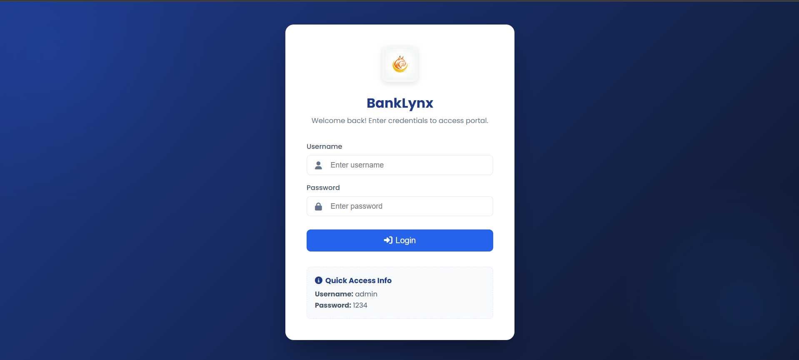
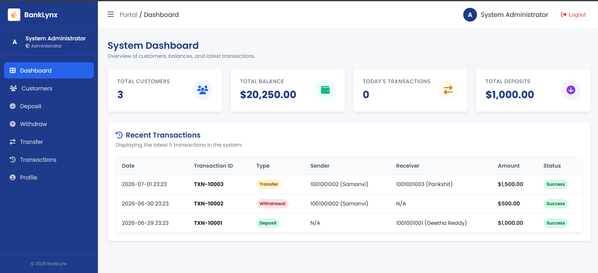
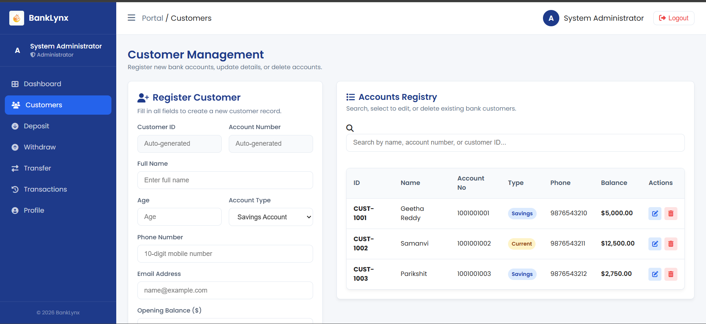
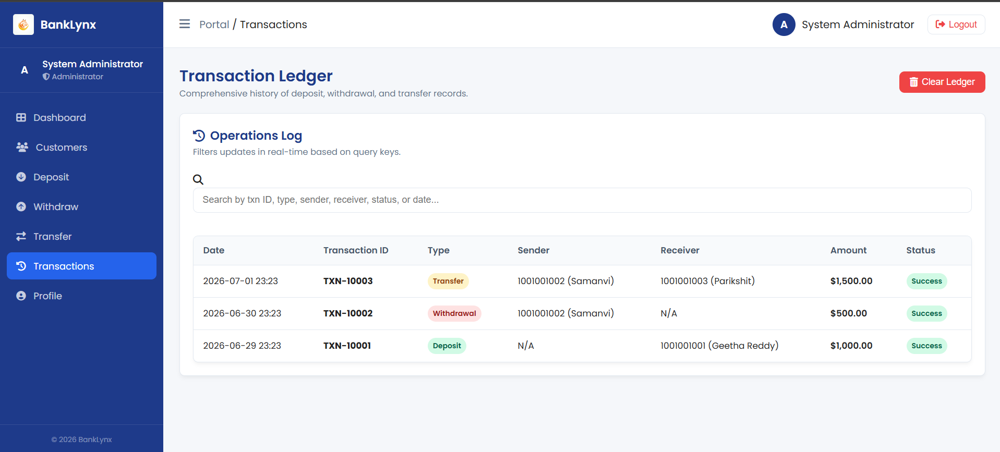

# 🏦 BankLynx – Banking Operations Dashboard

A modern, responsive **Bank Management System** built using **HTML, CSS, and JavaScript**. The application simulates core banking operations such as customer management, deposits, withdrawals, fund transfers, and transaction history using **LocalStorage** as the database.

> **Note:** This project demonstrates frontend development concepts without a backend.

---


## ✨ Features

### 🔐 Authentication
- Admin login system
- Session management using LocalStorage
- Protected pages
- Logout functionality

### 👥 Customer Management
- Register new customers
- Edit customer details
- Delete customers
- Search customers
- Auto-generated Customer ID
- Auto-generated Account Number

### 💰 Banking Operations
- Deposit funds
- Withdraw funds
- Transfer money between accounts
- Account verification before transactions
- Balance validation

### 📊 Dashboard
- Total customers
- Total account balance
- Today's transactions
- Total deposits
- Recent transaction history

### 📜 Transaction History
- Complete transaction ledger
- Search transactions
- Clear transaction history
- Date-wise transaction records

### 👤 Admin Profile
- Administrator information
- Last login timestamp
- Account status
- System permissions

---

# 🛠️ Technologies Used

- HTML5
- CSS3
- JavaScript (ES6)
- LocalStorage
- Font Awesome Icons

---

# 📂 Project Structure

```
BankLynx/
│
├── assets/
│   └── logo.png
│
├── css/
│   ├── style.css
│   ├── login.css
│   ├── dashboard.css
│   ├── customer.css
│   └── transaction.css
│
├── js/
│   ├── storage.js
│   ├── utils.js
│   ├── login.js
│   ├── dashboard.js
│   ├── customer.js
│   └── transaction.js
│
├── pages/
│   ├── dashboard.html
│   ├── customers.html
│   ├── deposit.html
│   ├── withdraw.html
│   ├── transfer.html
│   ├── transactions.html
│   └── profile.html
│
| screenshots/
│   ├── customers.png
│   ├── dashboard.png
│   ├── login.png
│   └── transactions.png
|
└── index.html
```
## 📸 Screenshots

<p align="center">
  
  
</p>

<p align="center">
  
  
</p>


---

# 🚀 Getting Started

### Clone the Repository

```bash
git clone https://github.com/your-username/BankLynx.git
```

### Open the Project

Simply open

```
index.html
```

in your preferred browser.

No installation or dependencies are required.

---

# 🔑 Default Login Credentials

| Username | Password |
|----------|----------|
| admin | 1234 |

---

# 📌 Modules

### Login
- User authentication
- Session handling

### Dashboard
- Banking overview
- Statistics
- Recent transactions

### Customers
- Add customer
- Update customer
- Delete customer
- Search customer

### Deposit
- Search account
- Deposit amount
- Balance update

### Withdraw
- Search account
- Withdraw amount
- Balance validation

### Transfer
- Sender verification
- Receiver verification
- Secure balance transfer

### Transactions
- Transaction history
- Search transactions
- Clear transaction log

### Profile
- Administrator details
- Last login information

---

# 💾 Data Storage

The application uses **Browser LocalStorage** to store:

- Admin information
- Customer records
- Transaction history
- Login status

No external database is required.

---

# 🎯 Future Improvements

- Node.js & Express Backend
- MongoDB / MySQL Database
- JWT Authentication
- Password Encryption
- Export Transactions as PDF/CSV
- Charts and Analytics
- Dark Mode
- Email Notifications
- Account Statements
- Interest Calculation
- Loan Management
- Responsive Mobile Navigation

---

# 📚 Learning Outcomes

This project helped in understanding:

- DOM Manipulation
- Event Handling
- CRUD Operations
- LocalStorage
- Modular JavaScript
- Responsive Web Design
- Form Validation
- Client-side Authentication
- Data Management

---

# 🤝 Contributing

Contributions, suggestions, and improvements are welcome.

Feel free to fork the repository and submit a pull request.


# 👨‍💻 Author

**Praneeth Reddy Pamireddy**

24CS01056

B.Tech Computer Science & Engineering

Indian Institute of Technology Bhubaneswar

---

⭐ If you found this project useful, consider giving it a star on GitHub!
